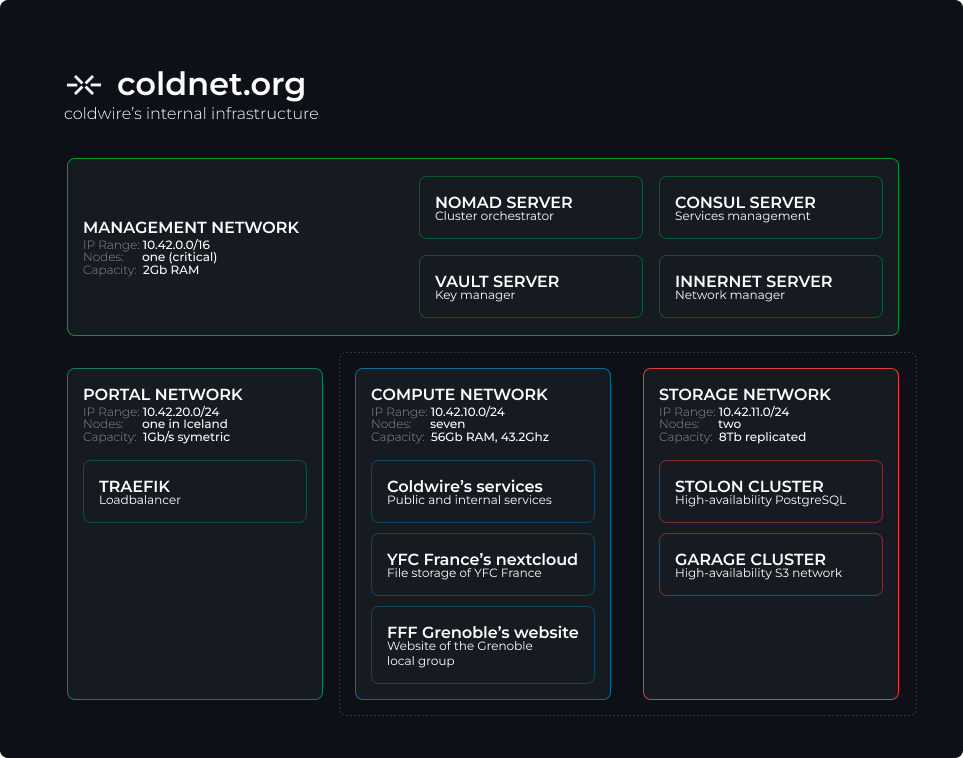

## Folder hierarchy
* **Cluster**: *every deployment configuration*
  * **friends**: *config for the friends of coldwire*
  * **services**: *config of the services of coldiwre*
  * **system**: *system services, making the whole infra working*
* **Servers**: *configuration of bare-metal servers*
  * **common**: *common configurations for every servers*
  * **manager**: *configurations for managers*
  * **nodes**: *configurations for nodes*
* **Utils**: *Tools for helping admins*
  * **doc**: *Documentation for the infra*
  * **scripts**: *helpers scripts for the admins*